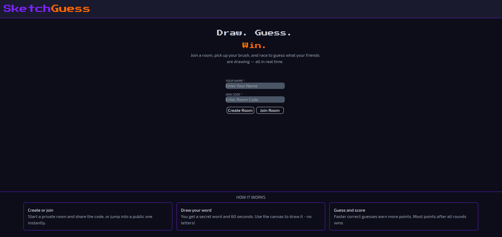
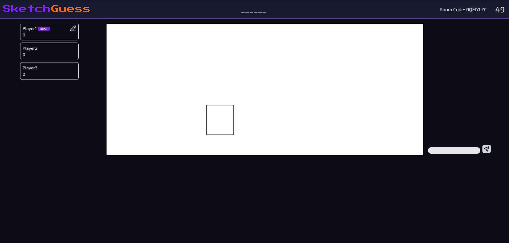
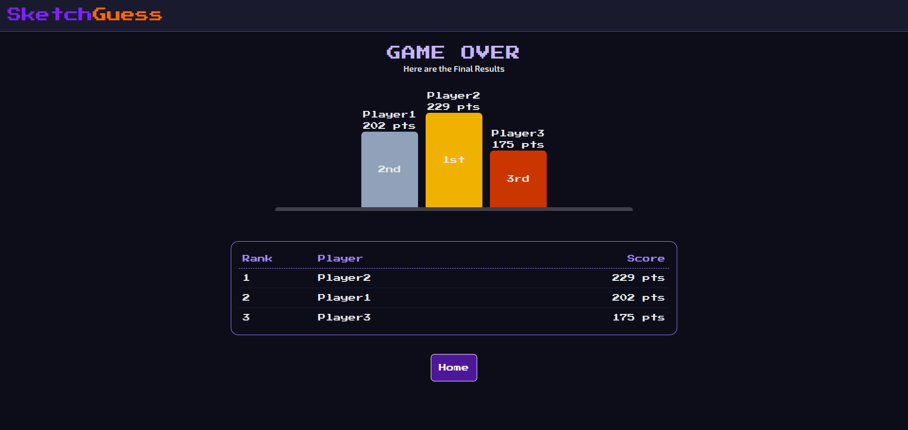

# Sketch Guess
A real-time multiplayer drawing and guessing game inspired by Skribbl.io

## Screenshots

### Landing Page

  

### Gameplay

  

### Final Results

  

## Status

**Version 1 Complete**

The core gameplay is fully functional. Future updates will focus on additional gameplay features and improvements.

## Gameplay
1. Create or join a room.
2. Host starts the game.
3. One player becomes the drawer.
4. Drawer selects one of three words.
5. Other players guess through chat.
6. Correct guesses earn time-based points.
7. After every turn, scores are shown.
8. Highest score after all rounds wins.

## Tech Stack

### Frontend
- React
- Tailwind CSS

### Backend
- Node.js
- Express.js
- Socket.IO

## Completed Features
- Canvas free-hand drawing
- basic shape tools
- Drawing and Chat synchronization
- Multiplayer room creation and joining 
- Word selection system
- Automatic word selection on timeout
- showing selected word to drawer and its encoding to guessers
- correct guess logic and displaying guessed correctly
- auto next turn on timer end
- update player points logic
- round end logic
- auto round end on timer end
- player disconnection handling
- auto room deletion 
- Brush size and color selection

## Future Enhancements
- undo redo buttons
- like unlike drawing option
- room host can kick or accept players
- shop logic to cast buff debuff
- private/ public room logic
- global leaderboard

## Design Decisions and their Reasons

### Why Nanoid for Unique Room ID generation?
**Initial approach:** Generate an ID by hashing a combination of 
username + timestamp with a secret key.

**Problem:** these type of hashes produce long outputs (32-64 chars) and
truncating to make them shareable increases collision probability 
significantly. Since each digit can be hexadecimal i.e 0-9 or a-f i.e 16 values

**Decision:** so i decided to use Nanoid since its specifically designed to produce short unique IDs with minimal chance of collision. Since Its default alphabet contains 64 URL-safe characters. Moreover it produces more share friendly joinCodes.

### Using Session storage
**Initial approach:** use local storage to store playerID to prevent score loss on reconnection

**Problem:** But this give rise to another Problem of overWriting player details if that same player rejoins from same browser using different name. Also to prevent this if i tend to store username in url parameter then link won't be shareable

**Decision:** Using Session Storage to store the playerID for that session only hence preventing overwriting on new tab and still playerID persists on tab reload

### Grace Period before player removal
**Initial approach:** Remove a player immediately when their socket disconnects.

**Problem:** Temporary network issues, browser refreshes, or accidental tab closures would permanently remove the player from the room, causing them to lose their game state and score even if they reconnected within a few seconds.

**Decision:** Introduced a 30-second grace period before removing a disconnected player. If the player reconnects within this window, they resume the game with the same player ID and score. Only after the timeout expires is the player permanently removed from the room.

### Automatic room Cleanup
**Initial approach:** Keep the room alive untill all rounds are completed.

**Problem:** Room continues on server even when all players have left the room hence consuming server memory.

**Decision:** As soon as the last player leaves a room, the room is automatically deleted from the server. Any subsequent attempt to access the room returns a 404, allowing the frontend to redirect users back to the home page instead of showing an invalid game state.

### Handling Single Player State
**Initial approach:** Continue the game even if single player left.

**Problem:** Game would have kept progressing to next rounds, since server sees no player is left to take a guess untill someone joins.

**Decision:** When only one player remains, the game enters a paused state for 10 seconds. If another player joins or someone rejoins during this period, the game resumes normally. Otherwise, the room is automatically deleted since meaningful gameplay is no longer possible and the last remaining player is guided to home page.

### Global Socket
**Initial approach:** using a global socket for all the pages of app

**Problem:** With this approach socket is created at landingPage which lasts for all pages.But if after someone joins the game and then goes back to the landing Page, now since socket has already joined the previous room, i have to remove previous joined rooms before letting him enter a new room. Moreover if after joining the game room reloads the game window now the original socket which had joined the room gets disconnected and a new socket is made for which i have to again call join room. Moreover

**Decision:** So this problem points that either i should create a new socket everytime a player enters game page or use a global socket but handle the extra remove previous room logic. So i created a seperate socket for game Page.

### Deferred Score Updates

**Initial approach:** Update each player's total score immediately after they guess the word correctly.

**Problem:** This causes the leaderboard to keep changing during gameplay, making the results screen less meaningful and preventing a clear per-turn score summary.

**Decision:** Introduced a separate `currTurnScore` for each player. Scores are calculated immediately after a correct guess but are only added to the total score during the **Show Results** phase. This keeps gameplay state and score updates separate while allowing the UI to display per-turn score additions.

##  Technical Challenges Faced and Solutions

### Live Preview

**Problem:**
If shapes are made along with user mouse movement then instead of only drawing completed shape, multiple copies of shapes are made along the way.

**Solution:** I used an array.
At the end when user releases the mouse final shape is stored in array. Then whole canvas is then cleared and shapes from array are redrawn.

### Canvas Sizing

**Problem:**
Canvas element uses a fixed width and height. As a result the drawing area did not adapt correctly to different screen sizes or window resizes, leading to layout and responsiveness issues.

**Solution:**
Added an observer to container of canvas to observe change in size. whenever change is detected, canvas size is adjusted accordingly to always fit its parent container making it responsive. Also since it erases all drawings due to change in size, all drawings are redrawn from array mentioned in live preview problem.

### Player Data storage on Frontend
**Problem:**
I originally used UseRef to store player data in a map.But since useRef doesn't trigger rerender any new players joined won't show up in playerList

**Solution:**
I swtiched to using UseState but since a map declared as useState doesn't allow direct insertion of element, so during SetPlayerList i declare a new map same as my previous map and then append new player Data in it and return the new map

### Round Information Synchronization
**Problem:**
The server emits roundInfo when new turn begins but sometimes since canvas Page hasn't reached rendering stage where it can accept the info hence it was missed. The main reason for this was since the roundInfo was generated on sent from landing page to server but utilized by canvas Page. so server never new when the canvas Page is ready to accept that info

**Solution:**
Implemented reqRoundInfo. 
So now whenever canvas Page is ready or need the round info it requests the server and server responds with the info. Hence ensuring the data recieve is never missed

### Different Views for Drawer and Guessers

**Problem:**
When a round starts, the drawer must see the actual word while every other player should only see its encoded form (i.e `_____`).This same logic should work even when the server automatically selects a word after the choosing timer expires, where no frontend socket event is available.

**Solution:**
Stored the current drawer's `socketID` on the server and used targeted Socket.IO emissions:
- `io.to(drawerSocketID).emit(...)` to send the actual word only to the drawer.
- `io.to(roomID).except(drawerSocketID).emit(...)` to send the encoded word to every other player.
This allowed the server to initiate the transition to the playing phase regardless of whether the word was chosen by the player or automatically after a timeout.
